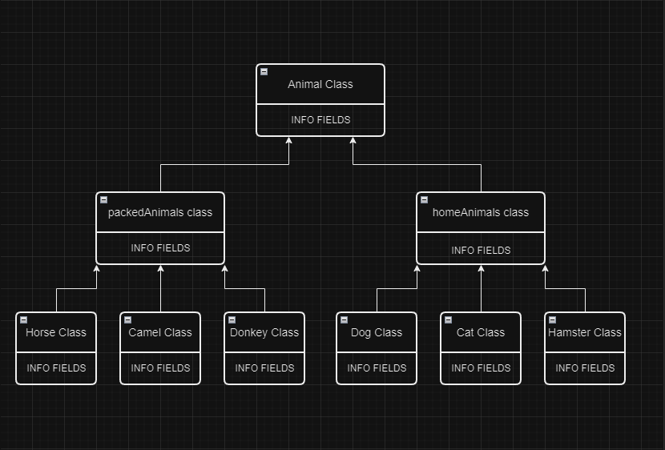

# Итоговая контрольная работа

## Информация о проекте
Необходимо организовать систему учета для питомника, в котором живут
домашние и вьючные животные.

## Задание
1. Используя команду cat в терминале операционной системы Linux, создать
два файла Домашние животные (заполнив файл собаками, кошками,
хомяками) и Вьючные животными заполнив файл Лошадьми, верблюдами и
ослы), а затем объединить их. Просмотреть содержимое созданного файла.
Переименовать файл, дав ему новое имя (Друзья человека).


2. Создать директорию, переместить файл туда.


3. Подключить дополнительный репозиторий MySQL. Установить любой пакет
из этого репозитория.


4. Установить и удалить deb-пакет с помощью dpkg.


5. Выложить [историю команд](commandHistory.md) в терминале ubuntu

6. Нарисовать [диаграмму](img/account_diagram.drawio), в которой есть класс родительский класс, домашние
животные и вьючные животные, в составы которых в случае домашних
животных войдут классы: собаки, кошки, хомяки, а в класс вьючные животные
войдут: Лошади, верблюды и ослы).



7. В подключенном MySQL репозитории создать базу данных “Друзья
человека”
```sql
CREATE DATABASE Human_friends;
```

8. Создать таблицы с иерархией из диаграммы в БД
```sql
USE Human_friends;
CREATE TABLE animal_classes
(
	Id INT AUTO_INCREMENT PRIMARY KEY, 
	Class_name VARCHAR(20)
);

INSERT INTO animal_classes (Class_name)
VALUES ('вьючные'),
('домашние');  


CREATE TABLE packed_animals
(
	  Id INT AUTO_INCREMENT PRIMARY KEY,
    Genus_name VARCHAR (20),
    Class_id INT,
    FOREIGN KEY (Class_id) REFERENCES animal_classes (Id) ON DELETE CASCADE ON UPDATE CASCADE
);

INSERT INTO packed_animals (Genus_name, Class_id)
VALUES ('Лошади', 1),
('Ослы', 1),  
('Верблюды', 1); 
    
CREATE TABLE home_animals
(
	  Id INT AUTO_INCREMENT PRIMARY KEY,
    Genus_name VARCHAR (20),
    Class_id INT,
    FOREIGN KEY (Class_id) REFERENCES animal_classes (Id) ON DELETE CASCADE ON UPDATE CASCADE
);

INSERT INTO home_animals (Genus_name, Class_id)
VALUES ('Кошки', 2),
('Собаки', 2),  
('Хомяки', 2); 

CREATE TABLE cats 
(       
    Id INT AUTO_INCREMENT PRIMARY KEY, 
    Name VARCHAR(20), 
    Birthday DATE,
    Commands VARCHAR(50),
    Genus_id int,
    Foreign KEY (Genus_id) REFERENCES home_animals (Id) ON DELETE CASCADE ON UPDATE CASCADE
);
```
9. Заполнить низкоуровневые таблицы именами(животных), командами
которые они выполняют и датами рождения
```sql
INSERT INTO cats (Name, Birthday, Commands, Genus_id)
VALUES ('Рыжик', '2000-01-01', 'кс-кс', 1),
('Беляш', '2010-01-01', "танцуй!", 1),  
('Мяука', '2020-01-01', "лежать", 1); 

CREATE TABLE dogs 
(       
    Id INT AUTO_INCREMENT PRIMARY KEY, 
    Name VARCHAR(20), 
    Birthday DATE,
    Commands VARCHAR(50),
    Genus_id int,
    Foreign KEY (Genus_id) REFERENCES home_animals (Id) ON DELETE CASCADE ON UPDATE CASCADE
);
INSERT INTO dogs (Name, Birthday, Commands, Genus_id)
VALUES ('Черныш', '2020-01-01', 'ко мне, голос', 2),
('Рич', '2021-06-12', "сидеть, лежать, лапу", 2),  
('Генрих', '2018-05-01', "лежать, лапу, фас", 2), 
('Злюка', '2021-05-10', "сидеть, лежать, фу", 2);

CREATE TABLE hamsters 
(       
    Id INT AUTO_INCREMENT PRIMARY KEY, 
    Name VARCHAR(20), 
    Birthday DATE,
    Commands VARCHAR(50),
    Genus_id int,
    Foreign KEY (Genus_id) REFERENCES home_animals (Id) ON DELETE CASCADE ON UPDATE CASCADE
);
INSERT INTO hamsters (Name, Birthday, Commands, Genus_id)
VALUES ('Малютка', '2020-10-12', 'Круть верть', 3),
('Малышарик', '2021-03-12', "Прыг скок", 3),  
('Пузатик', '2022-07-11', NULL, 3), 
('Вампир', '2022-05-10', NULL, 3);

CREATE TABLE horses 
(       
    Id INT AUTO_INCREMENT PRIMARY KEY, 
    Name VARCHAR(20), 
    Birthday DATE,
    Commands VARCHAR(50),
    Genus_id int,
    Foreign KEY (Genus_id) REFERENCES packed_animals (Id) ON DELETE CASCADE ON UPDATE CASCADE
);
INSERT INTO horses (Name, Birthday, Commands, Genus_id)
VALUES ('Зевс', '2020-01-12', 'бегом, шагом', 1),
('Посейдон', '2017-03-12', "бегом, шагом, хоп", 1),  
('Аид', '2016-07-12', "бегом, шагом, хоп", 1), 
('Цербер', '2020-11-10', "бегом хоп", 1);

CREATE TABLE donkeys 
(       
    Id INT AUTO_INCREMENT PRIMARY KEY, 
    Name VARCHAR(20), 
    Birthday DATE,
    Commands VARCHAR(50),
    Genus_id int,
    Foreign KEY (Genus_id) REFERENCES packed_animals (Id) ON DELETE CASCADE ON UPDATE CASCADE
);
INSERT INTO donkeys (Name, Birthday, Commands, Genus_id)
VALUES ('Ишак', '2019-04-10', NULL, 2),
('Каши', '2020-03-12', "", 2),  
('Медляк', '2021-07-12', "", 2), 
('Добряк', '2022-12-10', NULL, 2);

CREATE TABLE camels 
(       
    Id INT AUTO_INCREMENT PRIMARY KEY, 
    Name VARCHAR(20), 
    Birthday DATE,
    Commands VARCHAR(50),
    Genus_id int,
    Foreign KEY (Genus_id) REFERENCES packed_animals (Id) ON DELETE CASCADE ON UPDATE CASCADE
);
INSERT INTO camels (Name, Birthday, Commands, Genus_id)
VALUES ('Горбатый', '2022-04-10', 'лежать', 3),
('Худощавый', '2019-03-12', "встать!", 3),  
('Циничный', '2015-07-12', "отдых!", 3), 
('Волосатый', '2022-12-10', "кушай", 3);
```

10. Удалив из таблицы верблюдов, т.к. верблюдов решили перевезти в другой
питомник на зимовку. Объединить таблицы лошади, и ослы в одну таблицу.
```sql
SET SQL_SAFE_UPDATES = 0;
DELETE FROM camels;

SELECT Name, Birthday, Commands FROM horses
UNION SELECT  Name, Birthday, Commands FROM donkeys;
```

11. Создать новую таблицу “молодые животные” в которую попадут все
животные старше 1 года, но младше 3 лет и в отдельном столбце с точностью
до месяца подсчитать возраст животных в новой таблице
```sql
CREATE TEMPORARY TABLE animals AS 
SELECT *, 'Лошади' as genus FROM horses
UNION SELECT *, 'Ослы' AS genus FROM donkeys
UNION SELECT *, 'Собаки' AS genus FROM dogs
UNION SELECT *, 'Кошки' AS genus FROM cats
UNION SELECT *, 'Хомяки' AS genus FROM hamsters;

CREATE TABLE yang_animal AS
SELECT Name, Birthday, Commands, genus, TIMESTAMPDIFF(MONTH, Birthday, CURDATE()) AS Age_in_month
FROM animals WHERE Birthday BETWEEN ADDDATE(curdate(), INTERVAL -3 YEAR) AND ADDDATE(CURDATE(), INTERVAL -1 YEAR);
 
SELECT * FROM yang_animal;
```
12. Объединить все таблицы в одну, при этом сохраняя поля, указывающие на
прошлую принадлежность к старым таблицам.
```sql
SELECT h.Name, h.Birthday, h.Commands, pa.Genus_name, ya.Age_in_month 
FROM horses h
LEFT JOIN yang_animal ya ON ya.Name = h.Name
LEFT JOIN packed_animals pa ON pa.Id = h.Genus_id
UNION 
SELECT d.Name, d.Birthday, d.Commands, pa.Genus_name, ya.Age_in_month 
FROM donkeys d 
LEFT JOIN yang_animal ya ON ya.Name = d.Name
LEFT JOIN packed_animals pa ON pa.Id = d.Genus_id
UNION
SELECT c.Name, c.Birthday, c.Commands, ha.Genus_name, ya.Age_in_month 
FROM cats c
LEFT JOIN yang_animal ya ON ya.Name = c.Name
LEFT JOIN home_animals ha ON ha.Id = c.Genus_id
UNION
SELECT d.Name, d.Birthday, d.Commands, ha.Genus_name, ya.Age_in_month 
FROM dogs d
LEFT JOIN yang_animal ya ON ya.Name = d.Name
LEFT JOIN home_animals ha ON ha.Id = d.Genus_id
UNION
SELECT hm.Name, hm.Birthday, hm.Commands, ha.Genus_name, ya.Age_in_month 
FROM hamsters hm
LEFT JOIN yang_animal ya ON ya.Name = hm.Name
LEFT JOIN home_animals ha ON ha.Id = hm.Genus_id;
```

13. Создать [класс с Инкапсуляцией методов и наследованием по диаграмме](FullReadyUpCode/src/PetModels).
14. Написать [программу, имитирующую работу реестра домашних животных](FullReadyUpCode/src).
В программе должен быть реализован следующий функционал:    
	14.1 Завести новое животное    
	14.2 определять животное в правильный класс    
	14.3 увидеть список команд, которое выполняет животное    
	14.4 обучить животное новым командам    
	14.5 Реализовать навигацию по меню    
15. Создайте [класс Счетчик](FullReadyUpCode/src/MasterCode/count.java), у которого есть метод add(), увеличивающий̆
значение внутренней̆ int переменной̆ на 1 при нажатии “Завести новое
животное” Сделайте так, чтобы с объектом такого типа можно было работать в
блоке try-with-resources. Нужно бросить исключение, если работа с объектом
типа счетчик была не в ресурсном try и/или ресурс остался открыт. Значение
считать в ресурсе try, если при заведении животного заполнены все поля.


## Реализация программы


